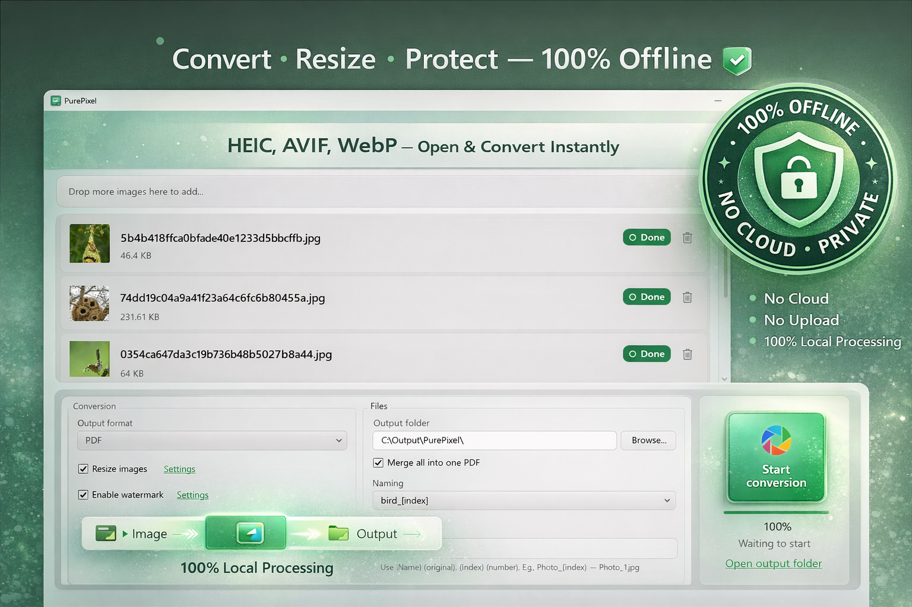

# PurePixel

> Stop uploading your images to online tools.

PurePixel is a fast, offline batch image converter for Windows.  
Convert, resize, compress, and watermark images locally — no uploads, no tracking.

---

## ⚠️ About This Repository

This is a **product showcase repository**.  
PurePixel is **proprietary software** — source code is not available.

👉 Download from Microsoft Store:  
[Get PurePixel](#)

---

## 🚀 Key Features

### Batch Image Processing
- Batch convert images in seconds
- Drag in multiple files or entire folders
- Recursively scan subfolders
- Keep original folder structure on export
- Smart filtering for non-image files

### Format Support
**Input:** JPG, PNG, BMP, WebP, HEIC, AVIF, GIF, TIFF  
**Output:** JPG, PNG, WebP, BMP, AVIF, ICO, PDF, TIFF

### Resize & Compression
- Resize by percentage or exact dimensions
- Lock aspect ratio automatically
- Long-edge resize for common publishing needs
- Compress images with high-quality output

### Watermark Tools
- Add text watermarks
- Add image/logo watermarks
- Adjust opacity
- Position watermarks with a 3×3 alignment grid
- Real-time preview

### Fast Local Performance
- Multi-threaded processing for large batches
- Built with a self-contained engine
- No plugins or extra components required

### Multilingual Experience
- Built-in support for 7 languages:
  - English
  - 简体中文
  - 繁體中文
  - 日本語
  - Français
  - Deutsch
  - Русский
- Automatically matches the system language

---

## ⚡ Why PurePixel

- **100% Offline** — no uploads, no privacy risks  
- **Privacy-First** — ideal for sensitive images  
- **Fast Batch Workflow** — save time on repetitive tasks  
- **Modern Windows 11 UI** — clean and native experience  
- **Multilingual** — ready for global users  

---

## 🎯 Use Cases

- E-commerce image processing  
- Social media publishing  
- Bulk image conversion  
- Logo and watermark branding  
- Private or sensitive image handling  

---

## 🖼️ Preview

100% offline image processing — no upload, no cloud, fully private.

---

## 🧩 How it works

1. Drag images or folders  
2. Choose output format  
3. Click convert

---

## 📦 Availability

Available on Microsoft Store.

👉 [Download PurePixel](#)

---

## © License

All rights reserved.  
This project is not open source.
